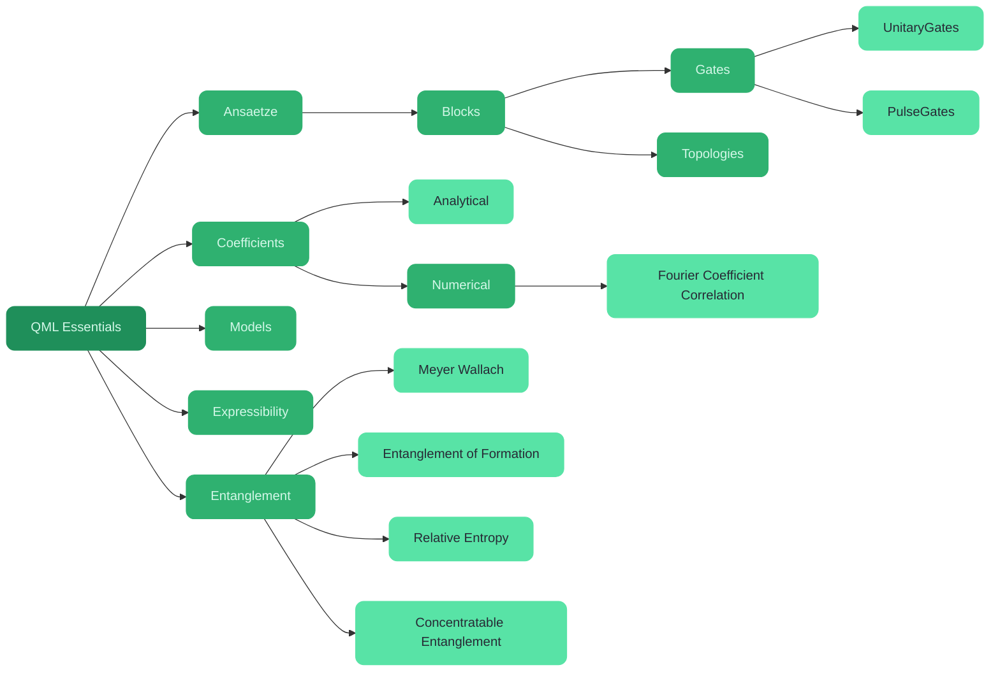

# QML Essentials

<p align="center">

</p>
<h3 align="center">A toolbox to make working with QML models easier.</h3>
<br/>

## 📜 About

This repo contains some of the commonly used Ansaetze and coding stuff required for working with QML and Data-Reuploading models.\
There are also dedicated classes to calculate entanglement and expressiblity of a provided model as well as its Fourier coefficients.
Checkout our [Arxiv Paper](https://arxiv.org/abs/2506.06695) to learn more.

## 🚀 Getting Started

```
pip install qml-essentials
```
or with the [uv package manager](https://github.com/astral-sh/uv):
```
uv add qml-essentials
```

to install our package from [PyPI](https://pypi.org/project/qml-essentials/).

<p align="center">

</p>
<p align="center">

</p>

You can find details on how to use it and further documentation on the corresponding [Github Page](https://cirkiters.github.io/qml-essentials/).

## 📦 Structure



## 🚧 Contributing

Contributions are highly welcome! 🤗 Take a look at our [Contribution Guidelines](https://github.com/cirKITers/qml-essentials/blob/main/CONTRIBUTING.md).

See our [coverage report](coverage/index.html) if you would like to contribute with further tests.
