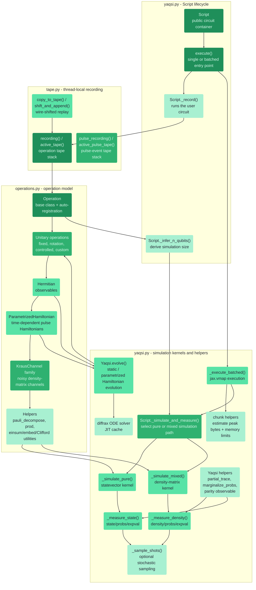

# YAQSI

This page aims to provide a brief overview of the YAQSI (yet another quantum simulator) embedded in our package.

The simulator aims to be fully abstracted by the `Model` class, so for most usecases, it should not be required to interact with the simulator directly.
However, some scenarios require building a custom circuits or require more granular control.

In the figure below, you can see how YAQSI provides the Foundation for the more standard interfaces `Model`, `Ansaetze` and `Gates`.
With the latter two being responsible of constructing quantum circuits and therefore interface direction with the `Operations` module of YAQSI, `Model` interfaces with the `Script` class, the main interface for circuit execution.

Generally, all operations are registered on a `Tape` when being created in the context of a `Script` (see examples below).
All matrix definitions (including Kraus channels for noisy simulation) are registered in the `Operations` module. 


While the standard gate execution is quite straight-forward, the pulse simulation requires a bit more care.
Here we split up `PulseGates` (abstracted by the `Gates` class) into `PulseParams` and `PulseEnvelope` to get more fine grained control over the underlying implementation.
As a single source of truth for both, there is the `PulseInformation` class, providing valid combination of these two characteristics.


## Quickstart

The API of our simulator is very similar to what one might be used to know from pennylane.
For a basic circuit execution, we have to do two imports:

```python
import qml_essentials.yaqsi as ys
import qml_essentials.operations as op
```

Next, we can create a circuit and specify the observable:

```python
def circuit():
    op.H(wires=0)
    op.CX(wires=[0, 1])

obs = [op.PauliZ(wires=0), op.PauliZ(wires=1)]
```

Finally, creating a `Script` and excute it will give us the probabilities for this standard Bell-Circuit:

```python
yss = ys.Script(circuit)
yss.execute(type="probs", obs=obs)
```

Parameterization of circuits is straightforward; you just have to pass the args to the `execute` function:

```python
import jax.numpy as jnp

n_qubits = 1

def circuit(phi, theta, omega):
    op.Rot(phi, theta, omega, wires=0)
    op.Rot(jnp.pi, 1/2*jnp.pi, 1/4*jnp.pi, wires=0)

obs = [op.PauliZ(wires=i) for i in range(n_qubits)]
yss = ys.Script(circuit)
yss.execute(type="expval", obs=obs, args=(jnp.pi, 1/2*jnp.pi, 1/4*jnp.pi))
```

Training those circuits is a breeze as we entirely build upon JAX and can just use OPTAX for this purpose:

```python
import optax as otx

def cost_fct(params):
    phi, theta, omega = params
    return yss.execute(type="expval", obs=[op.PauliZ(0)], args=(phi, theta, omega))[0]

params = jax.numpy.array([0.1, 0.2, 0.3])
opt = otx.adam(0.01)
opt_state = opt.init(params)

for epoch in range(1, 101):
    grads = jax.grad(cost_fct)(params)
    updates, opt_state = opt.update(grads, opt_state, params)
    params = otx.apply_updates(params, updates)

    if epoch % 10 == 0:
        print(f"Epoch: {epoch}, Cost: {cost_fct(params):.4f}")
```

Beyond this, you can conveniently call `.dagger()` or `.power()` on operations, ... 

```python
def circuit():
        op.RX(0.5, wires=0)
        op.RX(0.5, wires=0).dagger()
        op.PauliX(wires=0).power(2)

obs = [op.PauliZ(0)]
yss = ys.Script(circuit)
res = yss.execute(type="expval", obs=obs)

print(res) # we expect to end up in |0⟩ again
```

or combine them with different noise channels:

```python
def circuit():
    op.H(wires=0)
    op.CX(wires=[0, 1])
    op.DepolarizingChannel(0.1, wires=0)
    op.DepolarizingChannel(0.1, wires=1)

yss = ys.Script(circuit)
rho = yss.execute(type="density")
purity = jnp.real(jnp.trace(rho @ rho))
print(purity) # Purity should be < 1 
```

As [Pulse Gates](pulses.md) are built entirely upon YAQSI operations, you can also use those in the circuit to perform pulse level simulation:

```python
from qml_essentials.gates import PulseGates

def circuit(w):
    PulseGates.RX(w, wires=0)

obs = [op.PauliZ(0)]
yss = ys.Script(circuit)
res = yss.execute(type="expval", obs=obs, args=(jnp.pi*0.5,))
print(res) # expect sth. around 0 (but not too close)
```

Mixing pulse level simulation with noisy simulations is possible as well:

```python
def circuit(w):
    PulseGates.RX(w, wires=0)
    PulseGates.RY(w, wires=0)
    PulseGates.CX(wires=[0, 1])
    op.DepolarizingChannel(0.1, wires=0)
    op.DepolarizingChannel(0.1, wires=1)

yss = ys.Script(circuit)
res = yss.execute(type="density", args=(jnp.pi*0.5,))
purity = jnp.real(jnp.trace(rho @ rho))
print(purity) # Purity should be < 1 
```

You can visualize the pulses schedules, i.e. the sequence in which the pulses are applied on each qubit in the circuit, using the `draw` method.
Here, shaded areas represent the pulse shape/envelope (e.g. "Gaussian") of the pulse and the vertical line represents the time at which the pulse is applied.
Note that all gates are automatically decomposed into basis gates (e.g. `H` is decomposed into `RZ` and `RY`).

```python
def circuit(w):
    PulseGates.RX(w, wires=0)
    PulseGates.CZ(wires=0)
    PulseGates.H(wires=1)
    PulseGates.H(wires=1)

yss = ys.Script(circuit)

fig, axes = yss.draw(figure="pulse", args=(jnp.pi*0.5,))
```


## Technical Details

YAQSI is built with just a few dependencies:
- jax & jaxlib: used for general numerical operations
- optax: mainly used for quantum optimal control purposes internally, but of generally the starting point for doing any kind of training
- diffrax: source for the ODE solvers we use in the pulse simulation

For developers, the most important internal split is between operation definitions,
thread-local recording, and execution orchestration:



- `Operation` is the extension point for new gates or observables. Instances created
  inside a `Script` context append themselves to the active tape.
- `KrausChannel` switches execution to the density-matrix path, which is required for
  noisy simulation and for returning full density matrices.
- `Script.execute` records the circuit, infers the qubit count when necessary, then
  dispatches to the pure or mixed simulation kernel before measuring the requested
  result type.
- Batched execution wraps the same simulation path with `jax.vmap`; chunking estimates
  memory usage and splits large batches before execution.
- `Yaqsi.evolve` turns static or parametrized Hamiltonians into operations via the
  diffrax-backed pulse-evolution path, with cached JIT-compiled solvers.
- `tape.py` keeps recording thread-local, so nested recordings and pulse-event
  recordings do not leak across threads or circuit builds.

Note that we're using cache keys to detect already compiled JIT functions.
This may produce unexpected results when introducing new functionality which does either not hit the cache at all or hit the cache unexpectedly. 